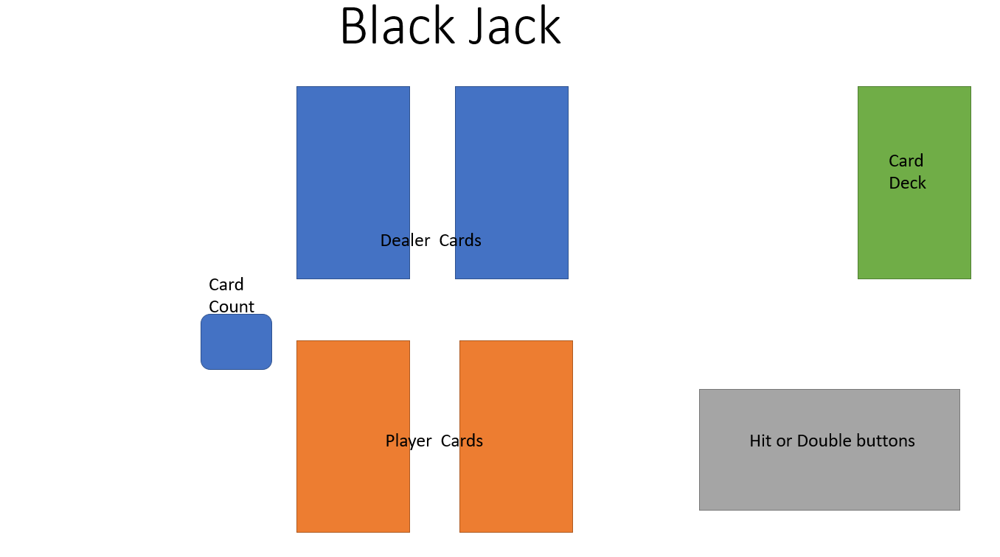
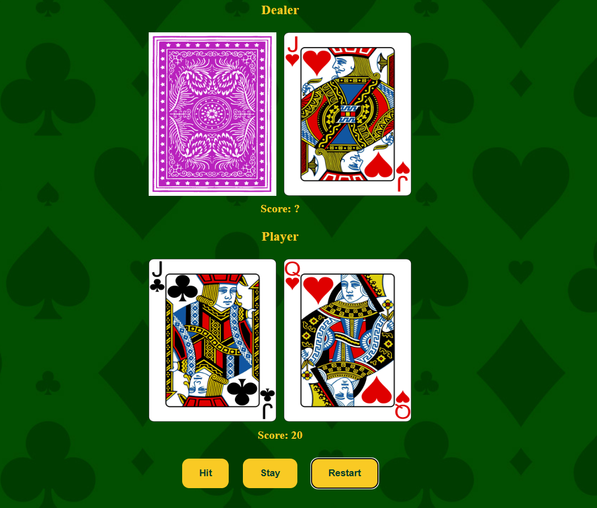

# Black_Jack_Project

## Date: 8/7/2025

### By: Mohamed Rashad

## [Linkedin](https://www.linkedin.com/in/mohamed-al-joamee-96274b36b/) [Github](https://github.com/M7139)

---

### **_Description_**

BlackJack is a game where you're dealt a hand and the goal is to be at or closer to 21 than the dealer.

### **Website**

The website is deployed using surge and can be found by going to this address:

## (https://black-jack-seb6.surge.sh/)

### **Wireframes**

##### First Draft: 

This was the first draft I did of how the website would look but I decided to to not spread the buttons and counter around and just make them all placed neatly in the same place. I discard the card deck because I didn't have the time to make it.

##### Final Result: 

After messing around with css this is the final result that I have came up with.

### **Game Logic**

This is how I coded my game:

1. I made an array that includes all of the cards with their values and images attached.

2. Created an object that refreances all of the DOM elements that are used.

3. On page load I added event listners to the actoin buttons.

4. When the game starts all cards will be shuffled and all values will be reset.

5. The dealer and player will be distributed 2 cards each.

6. The assigned cards will be displayed on the page.

7. The first card from the dealer will be hidden until the end of the game.

8. The player can choose between:
   hit : draw a card
   stand : end game
   restart : restart game

9. The game ends when the player's score is greater thn 21 or the play clicks on stand button

10. after the game ends, the dealer's score is calculated, if it is less than 17, the dealer draws cards until their score is greater than 17

11. after calculating the final scores all the dealer's cards are displayed, the winner is determined and the appropriate message is displayed

#### .

### **Functions Used and Credits**

1- For the deck array I used an object array that included all the cards values and attributes. Huge thanks for my teacher for recommending me to do it this way.

2- Fisher-Yates algo was used for the shuffle function which I looked up from this site:
https://www.geeksforgeeks.org/dsa/shuffle-a-given-array-using-fisher-yates-shuffle-algorithm/

3- W3schools has been a huge help to go through to understand different methods and functions when working wth the card hands arrays and how to move array objects from to another.
https://www.w3schools.com/jsref/jsref_pop.asp
